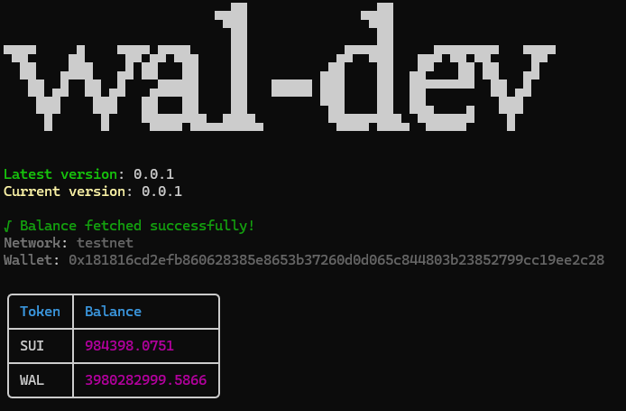

# Check SUI and WAL balance of the given address

###

## Command <Badge type="info" text="wal balance" />
```bash [npm]
wal balance <address>
```
- The wallet address to check

###

## Usage 
::: code-group
```bash [bash 1]
wal balance 0x123... --network testnet
```
```bash [bash 2]
wal balance 0x123... -n testnet
```
::: 

###

## Option 
> 🔴 Required, 🟡 Optional
- 🟡 `-n, --network` `<address>`: Specify network testnet or mainnet (default: "testnet")

## Result

