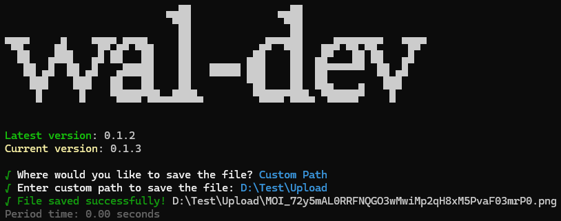

# Download file from Walrus using blob ID

###

## Command <Badge type="info" text="wal download" />
```bash [npm]
wal download <blobId> 
```
- The blobId of the file to download

###

## Usage 
::: code-group
```bash [bash 1]
wal download blobIDxabc --network testnet
```
```bash [bash 2]
wal download blobIDxabc -n testnet
```
:::

###

## Option
> 🔴 Required, 🟡 Optional
- 🔴 `-n, --network` `<network>`: Specify network mainnet or testnet

## Result

