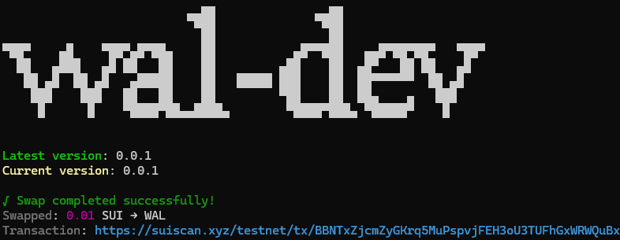

# Swap tokens SUI <-> WAL at 1:1 rate (testnet only)

###

## Command <Badge type="info" text="wal get" />
```bash [npm]
wal get <amount>
```
- Amount to swap (e.g., 0.1)

###

## Usage 

::: code-group
```bash [bash 1]
wal get 0.01 --token wal --privateKey suiprivkey0x1...
```
```bash [bash 2]
wal get 0.01 -t wal -pk suiprivkey0x1...
```
::: 

::: details Click to Faucet
[Discord](https://discord.com/channels/916379725201563759/1037811694564560966),
[faucet.sui](https://faucet.sui.io/),
[faucet.n1stake](https://faucet.n1stake.com/)
:::

###

## Option
> 🔴 Required, 🟡 Optional

- 🟡 `-t, --token` `<token>`: Token to receive: wal or sui (default: "wal")
- 🔴 `-pk, --privateKey` `<key>`: Private key sign the transaction

## Result

