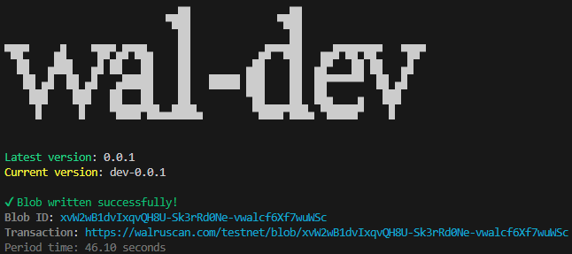

# Upload file with "Path:/to/x.x" or "text" on Walrus

###

## Command <Badge type="info" text="wal upload" />
```bash [npm]
wal upload <data>
```
- Any data files that need to be uploaded By specifying the location of the file

###

## Usage 
::: info 
**Can support many file formats such as .png, .txt, .jpeg, .pdf, .gif, .mp3** <br>
"Uploading and writing blobs requires $WAL, if you need [$WAL](/commands/wal-get.md) use the `wal get` command."
:::

::: code-group
```bash [bash 1]
wal upload "Path:/to/x.x" --privateKey suiprivkey0x1... --network testnet
```
```bash [bash 2]
wal upload "Path:/to/x.x" -pk suiprivkey0x1... -n testnet
```
::: 
or
::: code-group
```bash [bash 1]
wal upload "TEXT - Test upload with wal-dev" --privateKey suiprivkey0x1... --network testnet
```
```bash [bash 2]
wal upload "TEXT - Test upload with wal-dev" -pk suiprivkey0x1... -n testnet
```
:::

###

## Option
> 🔴 Required, 🟡 Optional

- 🔴 `-pk, --privateKey` `<key>`: Private key sign the transaction
- 🟡 `-n, --network` `<network>`: Specify network mainnet or testnet

## Result

