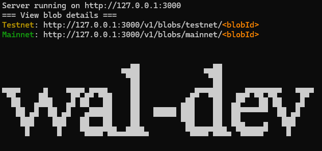
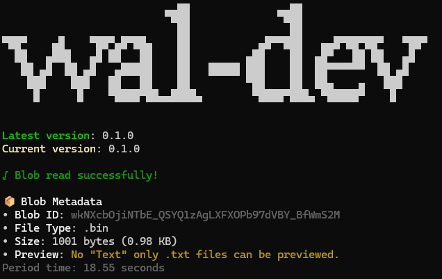

# wal-dev

## 0.1.3

### Patch Changes

- b006a27: update

## 0.1.2

### Patch Changes

- Start a local:3000 Walrus server for testing :
  `wal start`
  

## 0.1.1

### Patch Changes

- Preview data from Walrus using blob ID :
  `wal read` - A unique ID for data (file or text) uploaded to Walrus Protocol.
  

## 0.1.0

### Patch Changes

- 0a4f5ac: 🚀 wal-dev CLI v0.1 - Initial Release
  We’re excited to announce the first public release of wal-dev CLI version 0.1! 🎉
  This tool is designed to simplify and speed up the development workflow for Walrus.

  🧰 Initial Commands:

  - `wal balance` - Check the SUI and WAL token balance of an address.
  - `wal get` - Swap SUI <-> WAL tokens at a 1:1 rate (testnet only).
  - `wal upload` - Upload file with "Path:/to/x.x" or "text" on Walrus.
